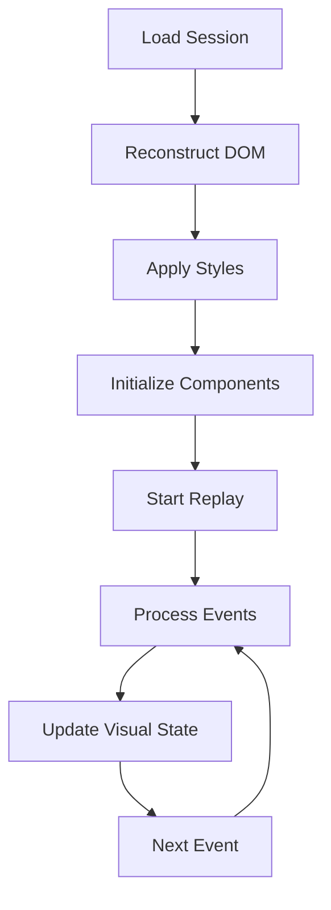

# EasyReplayer Session Replay System

The EasyReplayer system provides high-fidelity replay of recorded user sessions by reconstructing the DOM state and replaying events in their original sequence and timing. It works in conjunction with the [EasyEvents](../EasyEvents.md) system for event handling, [EasyRecorder](../EasyRecorder.md) for session capture, and [EasyCompress](../EasyCompress.md)/[EasyDecompress](../EasyDecompress.md) for data transmission.

## How Session Replay Works

The EasyReplayer system recreates user sessions through a multi-step process:

1. **Initial Setup**
   - Loads the original page state (DOM, styles, scripts)
   - Creates a virtual environment for replay
   - Initializes visual components (cursor, keyboard indicators)

2. **State Management**
   - Maintains a timeline of all recorded events
   - Tracks the current page state
   - Manages element focus and selection states
   - Preserves scroll positions and viewport state

3. **Event Replay**
   - Processes events in chronological order
   - Simulates user interactions (mouse, keyboard, scroll)
   - Applies DOM mutations as they occurred
   - Maintains precise timing between events

4. **Visual Feedback**
   - Shows cursor movement and clicks
   - Highlights keyboard interactions
   - Indicates scroll changes
   - Visualizes text selection

The system ensures accurate replay by:
- Preserving the exact timing of events
- Maintaining element relationships
- Handling dynamic content changes
- Managing state transitions
- Providing visual context

## Implementation Details

### 1. Session Loading

```javascript
// Initialize the replay system
const replayer = new EasyReplayer();

// Load session data
await replayer.load({
    recording: recordingData,  // Compressed event stream
    styles: stylesData,       // Page styles
    elements: domData,        // Initial DOM state
    scripts: scriptData       // Required scripts
});
```

### 2. State Reconstruction

1. **DOM Reconstruction**
   ```javascript
   // Load and parse DOM elements
   await replayer.loadElements(domData);
   
   // Register elements for tracking
   replayer.registerElements(document.body);
   ```

2. **Style Application**
   ```javascript
   // Initialize style manager
   const styles = new EasyStyles([
       originalStyles,
       replayStyles
   ]);
   ```

3. **Visual Components**
   ```javascript
   // Initialize cursor
   this.cursor = new EasyCursor();
   
   // Set up keyboard handler
   this.keyboard = new EasyKeyboard();
   ```

### 3. Event Processing

The system processes different types of events from the [EasyEvents](../EasyEvents.md) system:

#### Mouse Movement Events (Type 0)
The [EasyMouseMoveEvent](../EasyEvents/EasyMouseMoveEvent.md) handler manages cursor positioning and focus:
```javascript
replayMouseMoveEvent(event) {
    // Update cursor position
    this.cursor.setPosition(event.x, event.y);
    
    // Handle element focus
    if (event.focusedElement) {
        this.setFocus(event.focusedElement);
    }
}
```

#### Mouse Click Events (Type 1)
The [EasyMouseClickEvent](../EasyEvents/EasyMouseClickEvent.md) handler simulates mouse button interactions:
```javascript
replayMouseClickEvent(event) {
    // Position cursor
    this.cursor.setPosition(event.x, event.y);
    
    // Simulate button state
    this.cursor.setButton(event.button);
    
    // Handle click effects
    this.cursor.click(event);
}
```

#### Keyboard Events (Type 2)
The [EasyKeyboardEvent](../EasyEvents/EasyKeyboardEvent.md) handler manages keyboard input and text selection:
```javascript
replayKeyboardEvent(event) {
    // Simulate key press
    EasyKeyboard.typeKey(event);
    
    // Update input state if needed
    if (event.cursorPosition) {
        this.updateInputState(event);
    }
}
```

#### Scroll Events (Type 3)
The [EasyScrollEvent](../EasyEvents/EasyScrollEvent.md) handler manages viewport positioning:
```javascript
replayScrollEvent(event) {
    // Set scroll position
    window.scrollTo(event.x, event.y);
}
```

#### Mutation Events (Type 4)
The [EasyMutationEvent](../EasyEvents/EasyMutationEvent.md) handler manages DOM changes:
```javascript
replayMutationEvent(event) {
    // Apply DOM changes
    switch(event.type) {
        case 'childList':
            this.handleNodeChanges(event);
            break;
        case 'attributes':
            this.handleAttributeChanges(event);
            break;
    }
}
```

### 4. Timing Management

```javascript
class EasyReplayer {
    start() {
        this.startTime = Date.now() - this.recording[0].time;
        this.scheduleNextEvent();
    }

    scheduleNextEvent() {
        const event = this.recording[this.currentEvent];
        const delay = event.time - (Date.now() - this.startTime);
        
        setTimeout(() => {
            this.replayEvent(event);
            this.currentEvent++;
            if (this.currentEvent < this.recording.length) {
                this.scheduleNextEvent();
            }
        }, Math.max(0, delay));
    }
}
```

## Key Components

The replay system relies on three main supporting components:

### 1. EasyCursor
The [EasyCursor](./EasyCursor.md) component provides visual cursor simulation:
- Provides visual cursor representation
- Handles mouse movement animation
- Simulates click effects
- Manages cursor states

### 2. EasyKeyboard
The [EasyKeyboard](./EasyKeyboard.md) component handles keyboard simulation:
- Simulates keyboard input
- Manages input field states
- Handles modifier keys
- Maintains focus states

### 3. EasyStyles
The [EasyStyles](./EasyStyles.md) component manages visual styling:
- Manages stylesheet injection
- Handles dynamic styles
- Maintains style consistency
- Prevents style conflicts

## Event Flow



## Performance Optimizations

1. **Event Scheduling**
   ```javascript
   // Batch similar events
   if (event.type === 'mousemove' && 
       nextEvent.type === 'mousemove' && 
       nextEvent.time - event.time < 16) {
       // Skip intermediate events
       this.currentEvent++;
   }
   ```

2. **DOM Updates**
   ```javascript
   // Batch DOM mutations
   const mutations = this.collectRelatedMutations(event);
   requestAnimationFrame(() => {
       this.applyMutations(mutations);
   });
   ```

3. **Resource Management**
   ```javascript
   // Clean up unused resources
   cleanup() {
       this.cursor.dispose();
       this.styles.cleanup();
       this.clearEventQueue();
   }
   ```

## Error Handling

```javascript
class EasyReplayer {
    handleReplayError(error, event) {
        console.error(`Replay error at ${event.time}:`, error);
        
        // Attempt recovery
        try {
            this.recoverFromError(event);
        } catch (recoveryError) {
            this.pause();
            this.emit('error', recoveryError);
        }
    }
}
```

## Usage Example

```javascript
// Initialize replay
const replayer = new EasyReplayer();

// Load session data
await replayer.load({
    recording: await fetch('recording.php?id=' + sessionId),
    styles: await fetch('styles.php?id=' + sessionId),
    elements: await fetch('elements.php?id=' + sessionId)
});

// Configure replay
replayer.setSpeed(1.0);
replayer.setOptions({
    skipInactive: true,
    showCursor: true
});

// Start replay
replayer.start();

// Add event listeners
replayer.on('complete', () => {
    console.log('Replay completed');
});

replayer.on('error', (error) => {
    console.error('Replay error:', error);
});
```

## Best Practices

1. **Resource Loading**
   - Load resources in correct order
   - Verify resource integrity
   - Handle loading failures

2. **Event Processing**
   - Maintain event timing
   - Handle event dependencies
   - Validate event sequence

3. **State Management**
   - Track element states
   - Maintain focus chain
   - Handle dynamic content

4. **Error Recovery**
   - Implement fallbacks
   - Preserve core functionality
   - Log issues for debugging

Remember: The replay system aims to provide the most accurate reproduction of the original session while maintaining performance and reliability.