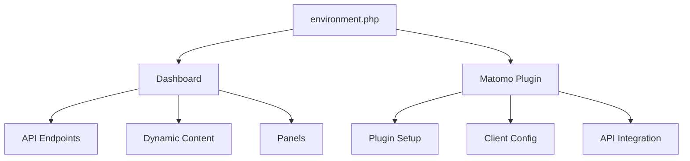

# Environment Configuration

The `environment.php` file provides centralized configuration for the EasyReplayer system. Located in the `shared/` directory, this file defines critical system settings including database connections, API endpoints, and site URLs. It serves as a bridge between the standalone dashboard and the Matomo plugin integration.

## Configuration Structure

The configuration is stored in a standard PHP object (`stdClass`) named `$env`:

```php
$env = new stdClass();
```

## Available Settings

### Database Configuration
```php
$env->dbHost = 'localhost';        // Database host address
$env->dbPort = '3306';            // Database port number
$env->dbUsername = 'username';     // Database user
$env->dbPassword = 'password';     // Database password
$env->dbName = 'analytics';        // Database name
$env->dbTablePrefix = 'ehm_';      // Table prefix for all system tables
```

### API Configuration
```php
$env->apiURL = 'https://api.example.com';  // Base URL for API endpoints
$env->siteURL = 'https://example.com';     // Main site URL
```

## System Integration

### Dashboard Implementation
```php
// In dashboard/index.php
require_once('../shared/environment.php');

// Database connection for session management
$connection = new mysqli(
    $env->dbHost,
    $env->dbUsername,
    $env->dbPassword,
    $env->dbName,
    $env->dbPort
);

// API endpoint construction for AJAX calls
$apiBase = $env->apiURL . '/api/';
```

### Matomo Plugin Integration
```php
// In matomo_plugin/EasySetup.php
class EasySetup extends Plugin {
    public function install() {
        require_once(PLUGIN_PATH . '/shared/environment.php');
        
        // Configure plugin with environment settings
        $config = [
            'database' => [
                'host' => $env->dbHost,
                'name' => $env->dbName,
                'prefix' => $env->dbTablePrefix
            ],
            'api' => [
                'baseUrl' => $env->apiURL,
                'siteUrl' => $env->siteURL
            ]
        ];
        
        // Initialize plugin with configuration
        $this->initializePlugin($config);
    }
}
```

## Cross-System Communication

### Dashboard to Matomo
```php
// In dashboard/api/settings.php
require_once('../../shared/environment.php');

// Construct Matomo API endpoint
$matomoAPI = $env->apiURL . '/index.php';
$request = [
    'module' => 'API',
    'method' => 'EasyHeatmap.getSettings',
    'format' => 'JSON'
];
```

### Matomo to Dashboard
```php
// In matomo_plugin/ClientConfig.php
class ClientConfig {
    public function getConfig() {
        require_once('shared/environment.php');
        
        return [
            'dashboardUrl' => $env->siteURL . '/dashboard/',
            'apiEndpoint' => $env->apiURL . '/api/',
            'tablePrefix' => $env->dbTablePrefix
        ];
    }
}
```

## Component-Specific Usage

### Dashboard Components
1. **API Endpoints** (`dashboard/api/`)
   ```php
   // Consistent database access across endpoints
   require_once('../../shared/environment.php');
   $recordingsTable = $env->dbTablePrefix . 'recordings';
   ```

2. **Dynamic Content** (`dashboard/dynamic/`)
   ```php
   // Configuration for dynamic content generation
   require_once('../../shared/environment.php');
   $apiBase = $env->apiURL . '/api/';
   ```

3. **Panel Integration** (`dashboard/panels/`)
   ```php
   // Panel-specific configuration
   require_once('../../shared/environment.php');
   $panelConfig = [
       'apiUrl' => $env->apiURL,
       'siteUrl' => $env->siteURL
   ];
   ```

### Matomo Plugin Components
1. **Setup Process** (`matomo_plugin/setup.php`)
   ```php
   // Plugin installation configuration
   require_once('shared/environment.php');
   $setupConfig = [
       'dbPrefix' => $env->dbTablePrefix,
       'apiBase' => $env->apiURL
   ];
   ```

2. **Client Configuration** (`matomo_plugin/ClientConfig.php`)
   ```php
   // Client-side settings
   require_once('shared/environment.php');
   $clientSettings = [
       'baseUrl' => $env->siteURL,
       'apiEndpoint' => $env->apiURL
   ];
   ```

## Security Considerations

1. **File Access**
   - Keep this file outside the web root
   - Set appropriate file permissions (typically 640)
   - Restrict access to necessary system users

2. **Sensitive Data**
   - Never commit real credentials to version control
   - Use environment-specific configurations
   - Consider using environment variables for sensitive values

3. **Database Security**
   - Use minimal required database privileges
   - Set strong passwords
   - Consider using connection encryption

## Best Practices

1. **Configuration Management**
   ```php
   // Create environment-specific files
   environment.dev.php
   environment.staging.php
   environment.production.php
   
   // Use a symlink for the active environment
   environment.php -> environment.production.php
   ```

2. **Validation**
   ```php
   // Validate required settings
   if (!isset($env->dbHost) || !isset($env->apiURL)) {
       throw new RuntimeException('Missing required configuration');
   }
   ```

3. **Error Handling**
   ```php
   // Handle configuration errors gracefully
   try {
       require_once('shared/environment.php');
   } catch (Exception $e) {
       error_log('Configuration error: ' . $e->getMessage());
       die('System configuration error');
   }
   ```

## System Architecture



## Deployment Considerations

1. **Dashboard Deployment**
   - Ensure correct path to environment.php
   - Validate database connectivity
   - Test API endpoint accessibility

2. **Plugin Deployment**
   - Verify Matomo compatibility
   - Check environment file permissions
   - Confirm cross-system communication

## Maintenance

1. **Updates**
   - Document all configuration changes
   - Maintain change history
   - Update related documentation

2. **Monitoring**
   - Log configuration access
   - Track configuration changes
   - Monitor for security issues

3. **Backup**
   - Maintain configuration backups
   - Document recovery procedures
   - Test restoration process

Remember: The environment configuration serves as a critical bridge between the dashboard and Matomo plugin components. Maintain consistency across both systems and ensure proper error handling in all integration points.

